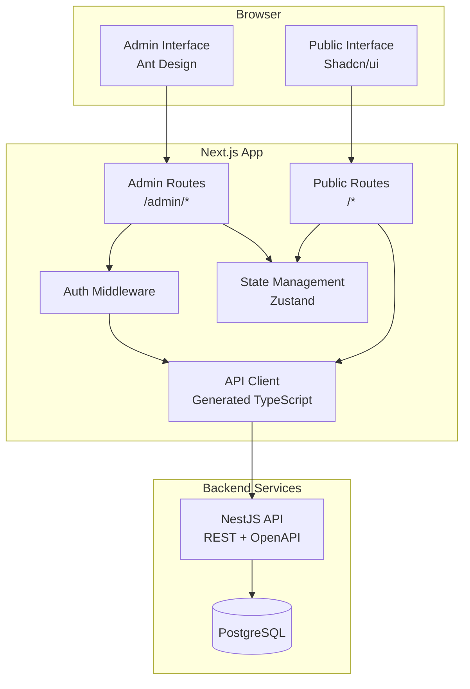

# Design Document - Admission Frontend

## Overview

Hệ thống Admission Frontend là ứng dụng web Next.js 14+ với App Router, cung cấp hai giao diện riêng biệt:

1. **Admin Interface**: Sử dụng Ant Design, dành cho nhân viên tuyển sinh với đầy đủ chức năng CRUD cho 12 modules
2. **Public Interface**: Sử dụng Shadcn/ui với Government Portal style, dành cho người dùng tra cứu thông tin

Hệ thống tích hợp với backend NestJS thông qua TypeScript API client đã được generate từ OpenAPI, hỗ trợ authentication JWT, RBAC, và đầy đủ quy trình tuyển sinh.

**Công nghệ chính:**
- Next.js 14+ (App Router)
- TypeScript
- Ant Design (Admin)
- Shadcn/ui (Public)
- React Hook Form + Zod
- Zustand (state management)

## Architecture

### High-Level Architecture



### Folder Structure

```
admission-frontend/
├── app/                          # Next.js App Router
│   ├── (admin)/                  # Admin route group
│   │   ├── layout.tsx           # Admin layout with sidebar
│   │   ├── dashboard/page.tsx
│   │   ├── users/page.tsx
│   │   ├── roles/page.tsx
│   │   ├── students/page.tsx
│   │   ├── programs/page.tsx
│   │   ├── sessions/page.tsx
│   │   ├── import/page.tsx
│   │   ├── filter/page.tsx
│   │   ├── results/page.tsx
│   │   ├── email/page.tsx
│   │   └── cms/
│   │       ├── posts/page.tsx
│   │       ├── categories/page.tsx
│   │       ├── faqs/page.tsx
│   │       └── media/page.tsx
│   ├── (public)/                 # Public route group
│   │   ├── layout.tsx           # Public layout
│   │   ├── page.tsx             # Homepage
│   │   ├── tra-cuu/page.tsx     # Result lookup
│   │   ├── nganh-tuyen-sinh/
│   │   │   ├── page.tsx         # Programs list
│   │   │   └── [slug]/page.tsx  # Program detail
│   │   ├── tin-tuc/
│   │   │   ├── page.tsx         # News list
│   │   │   └── [slug]/page.tsx  # Post detail
│   │   └── huong-dan/page.tsx   # Guides & FAQs
│   ├── login/page.tsx           # Login page
│   └── api/                      # API routes (if needed)
├── src/
│   ├── components/
│   │   ├── admin/               # Admin-specific components
│   │   │   ├── DataGrid/
│   │   │   │   ├── DataGrid.tsx
│   │   │   │   ├── DataGridSkeleton.tsx
│   │   │   │   └── types.ts
│   │   │   ├── FormModal/
│   │   │   │   ├── FormModal.tsx
│   │   │   │   └── types.ts
│   │   │   ├── FormDrawer/
│   │   │   │   ├── FormDrawer.tsx
│   │   │   │   └── types.ts
│   │   │   ├── ConfirmDialog/
│   │   │   ├── SearchBar/
│   │   │   ├── FilterPanel/
│   │   │   ├── AdminLayout/
│   │   │   │   ├── Sidebar.tsx
│   │   │   │   ├── Header.tsx
│   │   │   │   └── Breadcrumb.tsx
│   │   │   └── modules/         # Module-specific components
│   │   │       ├── users/
│   │   │       ├── students/
│   │   │       └── ...
│   │   ├── public/              # Public-specific components
│   │   │   ├── PublicLayout/
│   │   │   │   ├── Header.tsx
│   │   │   │   ├── Footer.tsx
│   │   │   │   └── Navigation.tsx
│   │   │   ├── NewsCard/
│   │   │   ├── ProgramCard/
│   │   │   ├── Hero/
│   │   │   └── SearchForm/
│   │   └── shared/              # Shared components
│   │       ├── LoadingSpinner/
│   │       ├── ErrorBoundary/
│   │       └── Toast/
│   ├── hooks/                   # Custom hooks
│   │   ├── useAuth.ts
│   │   ├── usePermissions.ts
│   │   ├── usePagination.ts
│   │   ├── useFilters.ts
│   │   ├── useModal.ts
│   │   └── useToast.ts
│   ├── lib/                     # Utilities
│   │   ├── api-client.ts        # API client wrapper
│   │   ├── auth.ts              # Auth utilities
│   │   ├── validation.ts        # Zod schemas
│   │   └── utils.ts             # Helper functions
│   ├── store/                   # Zustand stores
│   │   ├── authStore.ts
│   │   ├── uiStore.ts
│   │   └── index.ts
│   ├── types/                   # TypeScript types
│   │   ├── auth.ts
│   │   ├── api.ts
│   │   └── ui.ts
│   ├── api/                     # Generated API client (existing)
│   │   ├── services/
│   │   ├── models/
│   │   ├── core/
│   │   └── index.ts
│   ├── config/                  # Configuration
│   │   └── constants.ts
│   └── styles/                  # Global styles
│       └── globals.css
└── public/                      # Static assets
    ├── images/
    └── documents/
```

## Components and Interfaces

### 1. Authentication System

#### Auth Store (Zustand)

```typescript
interface AuthState {
  user: User | null;
  token: string | null;
  isAuthenticated: boolean;
  permissions: string[];
  
  login: (credentials: LoginCredentials) => Promise<void>;
  logout: () => void;
  refreshToken: () => Promise<void>;
  checkPermission: (permission: string) => boolean;
}
```

#### useAuth Hook

```typescript
interface UseAuthReturn {
  user: User | null;
  isAuthenticated: boolean;
  isLoading: boolean;
  login: (credentials: LoginCredentials) => Promise<void>;
  logout: () => void;
  checkPermission: (permission: string) => boolean;
}

function useAuth(): UseAuthReturn
```

#### Auth Middleware

```typescript
// Middleware for protected routes
async function authMiddleware(request: NextRequest): Promise<NextResponse>

// HOC for protected pages
function withAuth<P>(Component: ComponentType<P>): ComponentType<P>

// Hook for permission checking
function usePermissions(requiredPermissions: string[]): {
  hasPermission: boolean;
  isLoading: boolean;
}
```

### 2. DataGrid Component

#### DataGrid Props

```typescript
interface Column<T> {
  key: string;
  title: string;
  dataIndex: keyof T;
  sortable?: boolean;
  filterable?: boolean;
  render?: (value: any, record: T) => ReactNode;
  width?: number | string;
}

interface DataGridAction<T> {
  key: string;
  label: string;
  icon?: ReactNode;
  onClick: (record: T) => void;
  permission?: string;
  danger?: boolean;
}

interface DataGridProps<T> {
  columns: Column<T>[];
  data: T[];
  loading?: boolean;
  error?: Error | null;
  
  // Pagination
  pagination?: {
    current: number;
    pageSize: number;
    total: number;
    onChange: (page: number, pageSize: number) => void;
  };
  
  // Sorting
  sortable?: boolean;
  onSort?: (field: string, order: 'asc' | 'desc') => void;
  
  // Selection
  selectable?: boolean;
  selectedRows?: T[];
  onSelectionChange?: (selectedRows: T[]) => void;
  
  // Actions
  actions?: DataGridAction<T>[];
  
  // Search & Filter
  searchable?: boolean;
  onSearch?: (query: string) => void;
  filters?: FilterConfig[];
  onFilter?: (filters: Record<string, any>) => void;
}

function DataGrid<T>(props: DataGridProps<T>): JSX.Element
```

#### usePagination Hook

```typescript
interface UsePaginationReturn {
  currentPage: number;
  pageSize: number;
  total: number;
  totalPages: number;
  goToPage: (page: number) => void;
  nextPage: () => void;
  prevPage: () => void;
  setPageSize: (size: number) => void;
}

function usePagination(initialPageSize: number): UsePaginationReturn
```

### 3. Form Components

#### FormModal Component

```typescript
interface FormModalProps<T> {
  open: boolean;
  title: string;
  onClose: () => void;
  onSubmit: (data: T) => Promise<void>;
  initialValues?: Partial<T>;
  schema: ZodSchema<T>;
  children: (form: UseFormReturn<T>) => ReactNode;
  width?: number | string;
  loading?: boolean;
}

function FormModal<T>(props: FormModalProps<T>): JSX.Element
```

#### FormDrawer Component

```typescript
interface FormDrawerProps<T> {
  open: boolean;
  title: string;
  onClose: () => void;
  onSubmit: (data: T) => Promise<void>;
  initialValues?: Partial<T>;
  schema: ZodSchema<T>;
  children: (form: UseFormReturn<T>) => ReactNode;
  width?: number | string;
  loading?: boolean;
  placement?: 'left' | 'right';
}

function FormDrawer<T>(props: FormDrawerProps<T>): JSX.Element
```

#### useModal Hook

```typescript
interface UseModalReturn {
  isOpen: boolean;
  open: () => void;
  close: () => void;
  toggle: () => void;
}

function useModal(initialState?: boolean): UseModalReturn
```

### 4. Admin Layout Components

#### AdminLayout Component

```typescript
interface AdminLayoutProps {
  children: ReactNode;
}

function AdminLayout({ children }: AdminLayoutProps): JSX.Element
```

#### Sidebar Component

```typescript
interface MenuItem {
  key: string;
  label: string;
  icon: ReactNode;
  path: string;
  permission?: string;
  children?: MenuItem[];
}

interface SidebarProps {
  collapsed: boolean;
  onCollapse: (collapsed: boolean) => void;
  menuItems: MenuItem[];
}

function Sidebar(props: SidebarProps): JSX.Element
```

#### Header Component

```typescript
interface HeaderProps {
  onMenuClick: () => void;
  user: User;
  onLogout: () => void;
}

function Header(props: HeaderProps): JSX.Element
```

#### Breadcrumb Component

```typescript
interface BreadcrumbItem {
  label: string;
  path?: string;
}

interface BreadcrumbProps {
  items: BreadcrumbItem[];
}

function Breadcrumb(props: BreadcrumbProps): JSX.Element
```

### 5. Public Layout Components

#### PublicLayout Component

```typescript
interface PublicLayoutProps {
  children: ReactNode;
}

function PublicLayout({ children }: PublicLayoutProps): JSX.Element
```

#### Public Header Component

```typescript
interface NavItem {
  label: string;
  path: string;
  children?: NavItem[];
}

interface PublicHeaderProps {
  navItems: NavItem[];
}

function PublicHeader(props: PublicHeaderProps): JSX.Element
```

#### Public Footer Component

```typescript
interface FooterLink {
  label: string;
  path: string;
}

interface FooterSection {
  title: string;
  links: FooterLink[];
}

interface PublicFooterProps {
  sections: FooterSection[];
  contactInfo: {
    address: string;
    phone: string;
    email: string;
  };
}

function PublicFooter(props: PublicFooterProps): JSX.Element
```

### 6. Module-Specific Components

#### Users Module

```typescript
// User form schema
const userSchema = z.object({
  username: z.string().min(3).max(50),
  email: z.string().email(),
  password: z.string().min(8).optional(),
  fullName: z.string().min(1),
  roleId: z.string().uuid(),
  status: z.enum(['active', 'inactive']),
});

type UserFormData = z.infer<typeof userSchema>;

// Users page component
function UsersPage(): JSX.Element
```

#### Students Module

```typescript
// Student form schema
const studentSchema = z.object({
  studentId: z.string().min(1),
  fullName: z.string().min(1),
  dateOfBirth: z.date(),
  idCardNumber: z.string().min(9).max(12),
  email: z.string().email().optional(),
  phone: z.string().optional(),
  address: z.string().optional(),
  programId: z.string().uuid(),
  sessionId: z.string().uuid(),
  scores: z.object({
    math: z.number().min(0).max(10),
    literature: z.number().min(0).max(10),
    english: z.number().min(0).max(10),
  }),
});

type StudentFormData = z.infer<typeof studentSchema>;

// Students page component
function StudentsPage(): JSX.Element
```

#### Import Module

```typescript
interface ImportPreviewData {
  validRecords: StudentFormData[];
  invalidRecords: Array<{
    row: number;
    data: Partial<StudentFormData>;
    errors: string[];
  }>;
}

interface ImportModuleState {
  file: File | null;
  previewData: ImportPreviewData | null;
  isValidating: boolean;
  isImporting: boolean;
  importResult: ImportResult | null;
}

function ImportPage(): JSX.Element
```

#### Filter Module

```typescript
interface FilterConfig {
  sessionId: string;
  programIds: string[];
  criteria: {
    minScore: number;
    maxStudents: number;
  };
}

interface FilterProgress {
  status: 'idle' | 'running' | 'completed' | 'failed';
  progress: number;
  message: string;
  result?: FilterResult;
}

function FilterPage(): JSX.Element
```

### 7. Public Interface Components

#### Result Lookup Component

```typescript
interface ResultLookupFormData {
  idCardNumber: string;
}

interface AdmissionResult {
  student: {
    fullName: string;
    idCardNumber: string;
    dateOfBirth: string;
  };
  program: {
    name: string;
    code: string;
  };
  status: 'accepted' | 'rejected' | 'pending';
  score: number;
  ranking: number;
}

function ResultLookupPage(): JSX.Element
```

#### Programs List Component

```typescript
interface ProgramCardProps {
  program: {
    id: string;
    name: string;
    code: string;
    description: string;
    quota: number;
    currentEnrollment: number;
  };
}

function ProgramCard(props: ProgramCardProps): JSX.Element

function ProgramsPage(): JSX.Element
```

#### News Components

```typescript
interface NewsCardProps {
  post: {
    id: string;
    title: string;
    slug: string;
    excerpt: string;
    featuredImage: string;
    publishedAt: string;
    category: {
      name: string;
      slug: string;
    };
  };
}

function NewsCard(props: NewsCardProps): JSX.Element

function NewsPage(): JSX.Element

function PostDetailPage({ params }: { params: { slug: string } }): JSX.Element
```

## Data Models

### Authentication Models

```typescript
interface User {
  id: string;
  username: string;
  email: string;
  fullName: string;
  role: Role;
  status: 'active' | 'inactive';
  createdAt: string;
  updatedAt: string;
}

interface Role {
  id: string;
  name: string;
  description: string;
  permissions: Permission[];
}

interface Permission {
  id: string;
  name: string;
  resource: string;
  action: 'create' | 'read' | 'update' | 'delete';
}

interface LoginCredentials {
  username: string;
  password: string;
}

interface AuthTokens {
  accessToken: string;
  refreshToken?: string;
  expiresIn: number;
}
```

### Student Models

```typescript
interface Student {
  id: string;
  studentId: string;
  fullName: string;
  dateOfBirth: string;
  idCardNumber: string;
  email?: string;
  phone?: string;
  address?: string;
  program: Program;
  session: Session;
  scores: StudentScores;
  status: 'pending' | 'accepted' | 'rejected';
  ranking?: number;
  createdAt: string;
  updatedAt: string;
}

interface StudentScores {
  math: number;
  literature: number;
  english: number;
  total: number;
}
```

### Program Models

```typescript
interface Program {
  id: string;
  name: string;
  code: string;
  description: string;
  quota: number;
  currentEnrollment: number;
  status: 'active' | 'inactive';
  createdAt: string;
  updatedAt: string;
}

interface Session {
  id: string;
  name: string;
  startDate: string;
  endDate: string;
  status: 'upcoming' | 'active' | 'closed';
  createdAt: string;
  updatedAt: string;
}
```

### CMS Models

```typescript
interface Post {
  id: string;
  title: string;
  slug: string;
  excerpt: string;
  content: string;
  featuredImage?: string;
  category: Category;
  status: 'draft' | 'published';
  publishedAt?: string;
  author: User;
  createdAt: string;
  updatedAt: string;
}

interface Category {
  id: string;
  name: string;
  slug: string;
  description?: string;
  createdAt: string;
  updatedAt: string;
}

interface FAQ {
  id: string;
  question: string;
  answer: string;
  order: number;
  category?: string;
  createdAt: string;
  updatedAt: string;
}

interface MediaFile {
  id: string;
  filename: string;
  originalName: string;
  mimeType: string;
  size: number;
  url: string;
  thumbnailUrl?: string;
  uploadedBy: User;
  createdAt: string;
}
```

### UI State Models

```typescript
interface PaginationState {
  currentPage: number;
  pageSize: number;
  total: number;
}

interface SortState {
  field: string;
  order: 'asc' | 'desc';
}

interface FilterState {
  [key: string]: any;
}

interface DataGridState<T> {
  data: T[];
  loading: boolean;
  error: Error | null;
  pagination: PaginationState;
  sort: SortState | null;
  filters: FilterState;
  selectedRows: T[];
}
```


## Correctness Properties

*A property is a characteristic or behavior that should hold true across all valid executions of a system—essentially, a formal statement about what the system should do. Properties serve as the bridge between human-readable specifications and machine-verifiable correctness guarantees.*

### Property Reflection

Sau khi phân tích acceptance criteria, tôi đã xác định các properties có thể test được. Một số properties có thể được gộp lại để tránh trùng lặp:

**Redundancy Analysis:**
- Authentication properties (2.1-2.4) đều độc lập và cần thiết
- RBAC properties (3.1-3.6) có thể gộp 3.1 và 3.2 thành một property về permission checking
- DataGrid properties (5.1-5.6) đều độc lập
- Form validation properties (6.3, 6.4, 6.6) đều độc lập
- CRUD module properties có patterns tương tự nhưng áp dụng cho data khác nhau
- Error handling properties (27.1-27.7) có thể gộp một số properties về toast notifications

**Consolidated Properties:**
Sau khi reflection, tôi sẽ viết các properties đã được tối ưu hóa, loại bỏ redundancy.

### Core Authentication Properties

**Property 1: Valid credentials generate valid tokens**
*For any* valid username and password combination, when submitted to the authentication system, a JWT access token with 24-hour expiration should be generated and stored.
**Validates: Requirements 2.1**

**Property 2: Expired tokens trigger re-authentication**
*For any* expired JWT token, when used to access protected routes, the system should redirect to the login page.
**Validates: Requirements 2.2**

**Property 3: Valid tokens grant access to protected routes**
*For any* protected route and any valid (non-expired) JWT token, the authentication system should allow access to that route.
**Validates: Requirements 2.3**

**Property 4: Logout clears all authentication state**
*For any* authenticated session, after logout is triggered, no JWT tokens should remain in storage and the user should be redirected to login.
**Validates: Requirements 2.4**

**Property 5: Invalid credentials produce error messages**
*For any* invalid username or password combination, when submitted to the authentication system, a clear error message should be displayed to the user.
**Validates: Requirements 2.6**

### Authorization and RBAC Properties

**Property 6: Permission checking controls resource access**
*For any* protected resource and any user, access should be granted if and only if the user has the required permission for that resource.
**Validates: Requirements 3.1, 3.2**

**Property 7: UI elements respect permission requirements**
*For any* UI component with permission requirements, the component should render if and only if the current user has those permissions.
**Validates: Requirements 3.3**

**Property 8: API requests respect permission requirements**
*For any* API request requiring permissions, the request should be made if and only if the current user has those permissions.
**Validates: Requirements 3.4**

**Property 9: Permission updates take effect immediately**
*For any* user whose permissions are modified, subsequent permission checks should reflect the new permissions without requiring re-authentication.
**Validates: Requirements 3.5**

**Property 10: CRUD permissions are independent**
*For any* resource, a user with only "read" permission should be able to view but not create, update, or delete that resource.
**Validates: Requirements 3.6**

### Navigation and Layout Properties

**Property 11: Breadcrumb reflects current route**
*For any* route in the admin interface, the breadcrumb component should display the correct path hierarchy for that route.
**Validates: Requirements 4.3**

**Property 12: Menu navigation updates route**
*For any* menu item in the sidebar, clicking that item should navigate to its corresponding route.
**Validates: Requirements 4.4**

**Property 13: Active menu item matches current route**
*For any* route in the admin interface, the menu item corresponding to that route should be highlighted as active.
**Validates: Requirements 4.5**

**Property 14: Sidebar state persists across sessions**
*For any* sidebar collapse state (collapsed or expanded), after refreshing the page, the sidebar should restore to the same state.
**Validates: Requirements 4.7**

### DataGrid Component Properties

**Property 15: DataGrid renders all provided data**
*For any* array of data records and column configuration, the DataGrid should render a table row for each record with cells matching the column configuration.
**Validates: Requirements 5.1**

**Property 16: Pagination divides data correctly**
*For any* dataset with N records and page size P, the DataGrid should display exactly P records per page (except the last page which may have fewer).
**Validates: Requirements 5.2**

**Property 17: Sorting orders data correctly**
*For any* sortable column, clicking the column header should reorder the data in ascending order, and clicking again should reorder in descending order.
**Validates: Requirements 5.3**

**Property 18: Filtering shows only matching records**
*For any* filter criteria applied to the DataGrid, only records matching all filter criteria should be displayed.
**Validates: Requirements 5.4**

**Property 19: Row selection tracks selected rows**
*For any* row in the DataGrid, selecting that row should add it to the selected rows collection, and deselecting should remove it.
**Validates: Requirements 5.5**

**Property 20: Action buttons trigger callbacks**
*For any* action button configuration and any row, clicking the action button should invoke the configured callback with that row's data.
**Validates: Requirements 5.6**

### Form Component Properties

**Property 21: Valid form data triggers submission**
*For any* form with valid data (passing Zod schema validation), submitting the form should invoke the onSubmit callback with that data.
**Validates: Requirements 6.3**

**Property 22: Invalid form data shows validation errors**
*For any* form with invalid data (failing Zod schema validation), submitting the form should display inline validation errors for each invalid field and not invoke onSubmit.
**Validates: Requirements 6.4**

**Property 23: Zod schema validation is enforced**
*For any* Zod schema provided to a form component, the form should validate data against that schema and reject data that doesn't conform.
**Validates: Requirements 6.6**

**Property 24: Successful submission closes form**
*For any* form submission that succeeds (onSubmit resolves without error), the form should close and display a success notification.
**Validates: Requirements 6.8**

**Property 25: Failed submission keeps form open**
*For any* form submission that fails (onSubmit rejects with error), the form should remain open and display an error notification.
**Validates: Requirements 6.9**

### CRUD Module Properties

**Property 26: Edit action pre-fills form with record data**
*For any* CRUD module and any record, clicking the edit action should open a form with all fields pre-filled with that record's current data.
**Validates: Requirements 7.3, 9.3, 10.3, 11.3, 16.3, 17.3, 18.3**

**Property 27: Delete confirmation removes record**
*For any* CRUD module and any record, clicking delete and confirming should remove that record from the displayed list.
**Validates: Requirements 7.5, 9.5, 10.5, 11.5, 16.7, 17.6, 18.7**

**Property 28: Search filters records by query**
*For any* CRUD module with search functionality and any search query, only records matching the query in searchable fields should be displayed.
**Validates: Requirements 7.6, 9.6, 19.8**

**Property 29: Filter shows only matching records**
*For any* CRUD module with filter functionality and any filter criteria, only records matching all filter criteria should be displayed.
**Validates: Requirements 7.7, 9.7, 16.9, 24.4**

**Property 30: Validation prevents invalid submissions**
*For any* CRUD module form and any invalid data (failing Zod schema), the form should prevent submission and display validation errors.
**Validates: Requirements 7.8, 9.8**

**Property 31: Assigned roles cannot be deleted**
*For any* role that is assigned to one or more users, attempting to delete that role should be prevented with an appropriate message.
**Validates: Requirements 8.8**

**Property 32: Programs with students cannot be deleted**
*For any* program that has associated students, attempting to delete that program should be prevented with an appropriate message.
**Validates: Requirements 10.6**

**Property 33: Sessions with students cannot be deleted**
*For any* session that has associated students, attempting to delete that session should be prevented with an appropriate message.
**Validates: Requirements 11.6**

**Property 34: Categories with posts cannot be deleted**
*For any* category that has associated posts, attempting to delete that category should be prevented with an appropriate message.
**Validates: Requirements 17.6**

### Excel Import Properties

**Property 35: Invalid file format shows error**
*For any* uploaded file that is not a valid Excel format, the import module should display an error message describing the required format.
**Validates: Requirements 12.3**

**Property 36: Valid Excel file is parsed and previewed**
*For any* valid Excel file with student data, the import module should parse the data and display a preview table with all records.
**Validates: Requirements 12.4**

**Property 37: Invalid records are highlighted in preview**
*For any* Excel file containing invalid records (failing validation), those records should be highlighted with error messages in the preview table.
**Validates: Requirements 12.5**

**Property 38: Only valid records are imported**
*For any* import confirmation, only records that pass validation should be sent to the API for import.
**Validates: Requirements 12.6**

**Property 39: Import summary shows accurate counts**
*For any* completed import operation, the summary should display the correct count of successful and failed records.
**Validates: Requirements 12.8**

### Result Lookup Properties

**Property 40: Valid ID card number fetches result**
*For any* valid ID card number format, submitting the lookup form should call the API to fetch the admission result.
**Validates: Requirements 23.2**

**Property 41: Found results display complete information**
*For any* ID card number with an existing result, the result page should display student information, program name, admission status, score, and ranking (if accepted).
**Validates: Requirements 23.3, 23.5**

**Property 42: Not found results show appropriate message**
*For any* ID card number with no existing result, the result page should display a "No result found" message.
**Validates: Requirements 23.4**

**Property 43: Invalid ID format prevents submission**
*For any* ID card number that doesn't match the required format, the lookup form should prevent submission and display a validation error.
**Validates: Requirements 23.6**

### Error Handling Properties

**Property 44: Failed API requests show error notifications**
*For any* API request that fails (network error, server error, etc.), a toast notification with an error message should be displayed.
**Validates: Requirements 27.1**

**Property 45: Form validation errors appear inline**
*For any* form field that fails validation, an inline error message should appear next to that field.
**Validates: Requirements 27.2**

**Property 46: Network errors show user-friendly messages**
*For any* network error (timeout, connection refused, etc.), a user-friendly error message should be displayed instead of technical error details.
**Validates: Requirements 27.3**

**Property 47: Successful actions show success notifications**
*For any* action that completes successfully (create, update, delete, etc.), a success toast notification should be displayed.
**Validates: Requirements 27.4**

**Property 48: React errors are caught by error boundaries**
*For any* React component error (render error, lifecycle error, etc.), an error boundary should catch the error and display a fallback UI.
**Validates: Requirements 27.5**

**Property 49: Unexpected errors show fallback UI**
*For any* unexpected error that occurs during application execution, a fallback UI with error details should be displayed.
**Validates: Requirements 27.6**

**Property 50: Errors are logged to console**
*For any* error that occurs in the application, that error should be logged to the browser console for debugging.
**Validates: Requirements 27.7**

## Error Handling

### Error Categories

1. **Authentication Errors**
   - Invalid credentials
   - Expired tokens
   - Missing tokens
   - Insufficient permissions

2. **Validation Errors**
   - Form validation failures (Zod schema violations)
   - File format errors (Excel import)
   - Data type mismatches
   - Required field violations

3. **API Errors**
   - Network errors (timeout, connection refused)
   - Server errors (5xx status codes)
   - Client errors (4xx status codes)
   - Rate limiting errors

4. **Application Errors**
   - React component errors
   - State management errors
   - Routing errors
   - Unexpected runtime errors

### Error Handling Strategy

#### 1. Error Boundaries

```typescript
class ErrorBoundary extends React.Component<Props, State> {
  static getDerivedStateFromError(error: Error): State {
    return { hasError: true, error };
  }

  componentDidCatch(error: Error, errorInfo: ErrorInfo) {
    // Log to console
    console.error('Error caught by boundary:', error, errorInfo);
    
    // Could send to error tracking service
    // errorTrackingService.log(error, errorInfo);
  }

  render() {
    if (this.state.hasError) {
      return <ErrorFallback error={this.state.error} />;
    }
    return this.props.children;
  }
}
```

#### 2. API Error Handling

```typescript
async function apiCall<T>(request: () => Promise<T>): Promise<T> {
  try {
    return await request();
  } catch (error) {
    // Handle authentication errors
    if (error.status === 401) {
      authStore.logout();
      router.push('/login');
      throw new Error('Session expired. Please login again.');
    }
    
    // Handle authorization errors
    if (error.status === 403) {
      toast.error('You do not have permission to perform this action.');
      throw new Error('Insufficient permissions');
    }
    
    // Handle validation errors
    if (error.status === 400) {
      const message = error.body?.message || 'Invalid request';
      toast.error(message);
      throw error;
    }
    
    // Handle server errors
    if (error.status >= 500) {
      toast.error('Server error. Please try again later.');
      throw new Error('Server error');
    }
    
    // Handle network errors
    if (!error.status) {
      toast.error('Network error. Please check your connection.');
      throw new Error('Network error');
    }
    
    // Log and rethrow
    console.error('API error:', error);
    throw error;
  }
}
```

#### 3. Form Validation Error Display

```typescript
// React Hook Form automatically handles Zod validation errors
// Errors are displayed inline using the form's error state

function FormField({ name, label, form }) {
  const error = form.formState.errors[name];
  
  return (
    <div>
      <label>{label}</label>
      <input {...form.register(name)} />
      {error && <span className="error">{error.message}</span>}
    </div>
  );
}
```

#### 4. Toast Notifications

```typescript
// Centralized toast notification system
const toast = {
  success: (message: string) => {
    notification.success({
      message: 'Success',
      description: message,
      placement: 'topRight',
    });
  },
  
  error: (message: string) => {
    notification.error({
      message: 'Error',
      description: message,
      placement: 'topRight',
    });
  },
  
  warning: (message: string) => {
    notification.warning({
      message: 'Warning',
      description: message,
      placement: 'topRight',
    });
  },
  
  info: (message: string) => {
    notification.info({
      message: 'Info',
      description: message,
      placement: 'topRight',
    });
  },
};
```

### Error Recovery Strategies

1. **Retry Logic**: For transient network errors, implement automatic retry with exponential backoff
2. **Fallback UI**: Display user-friendly error messages with actionable recovery steps
3. **State Preservation**: Preserve form data when errors occur to prevent data loss
4. **Graceful Degradation**: Continue showing cached data when API calls fail
5. **Error Reporting**: Log errors to console (and optionally to error tracking service)

## Testing Strategy

### Dual Testing Approach

The testing strategy combines two complementary approaches:

1. **Unit Tests**: Verify specific examples, edge cases, and error conditions
2. **Property-Based Tests**: Verify universal properties across all inputs

Both are necessary for comprehensive coverage. Unit tests catch concrete bugs in specific scenarios, while property-based tests verify general correctness across a wide range of inputs.

### Property-Based Testing Configuration

**Library Selection**: 
- **fast-check** for TypeScript/JavaScript property-based testing
- Integrates well with Jest/Vitest test frameworks

**Configuration**:
- Minimum 100 iterations per property test (due to randomization)
- Each property test must reference its design document property
- Tag format: `// Feature: admission-frontend, Property {number}: {property_text}`

**Example Property Test**:

```typescript
import fc from 'fast-check';
import { describe, it, expect } from 'vitest';

describe('Authentication Properties', () => {
  it('Property 1: Valid credentials generate valid tokens', () => {
    // Feature: admission-frontend, Property 1: Valid credentials generate valid tokens
    
    fc.assert(
      fc.asyncProperty(
        fc.record({
          username: fc.string({ minLength: 3, maxLength: 50 }),
          password: fc.string({ minLength: 8, maxLength: 100 }),
        }),
        async (credentials) => {
          // Setup: Create user with these credentials
          await createTestUser(credentials);
          
          // Act: Login with credentials
          const result = await authService.login(credentials);
          
          // Assert: Token should be generated
          expect(result.accessToken).toBeDefined();
          expect(result.expiresIn).toBe(24 * 60 * 60); // 24 hours
          
          // Cleanup
          await deleteTestUser(credentials.username);
        }
      ),
      { numRuns: 100 }
    );
  });
  
  it('Property 3: Valid tokens grant access to protected routes', () => {
    // Feature: admission-frontend, Property 3: Valid tokens grant access to protected routes
    
    fc.assert(
      fc.asyncProperty(
        fc.record({
          username: fc.string({ minLength: 3 }),
          password: fc.string({ minLength: 8 }),
        }),
        fc.constantFrom('/admin/users', '/admin/students', '/admin/programs'),
        async (credentials, protectedRoute) => {
          // Setup: Create user and get token
          await createTestUser(credentials);
          const { accessToken } = await authService.login(credentials);
          
          // Act: Access protected route with token
          const response = await fetch(protectedRoute, {
            headers: { Authorization: `Bearer ${accessToken}` },
          });
          
          // Assert: Should have access
          expect(response.status).not.toBe(401);
          expect(response.status).not.toBe(403);
          
          // Cleanup
          await deleteTestUser(credentials.username);
        }
      ),
      { numRuns: 100 }
    );
  });
});
```

### Unit Testing Strategy

**Focus Areas for Unit Tests**:

1. **Specific Examples**:
   - Login with specific valid credentials
   - Create user with specific data
   - Import Excel file with known data

2. **Edge Cases**:
   - Empty form submissions
   - Maximum length inputs
   - Special characters in inputs
   - Boundary values (min/max scores, dates)

3. **Error Conditions**:
   - Network timeout
   - Server 500 error
   - Invalid file format
   - Duplicate entries

4. **Integration Points**:
   - API client integration
   - Component composition
   - State management integration

**Example Unit Test**:

```typescript
import { describe, it, expect, vi } from 'vitest';
import { render, screen, fireEvent, waitFor } from '@testing-library/react';
import { LoginPage } from './LoginPage';

describe('LoginPage', () => {
  it('should display error message for invalid credentials', async () => {
    // Arrange
    const mockLogin = vi.fn().mockRejectedValue(new Error('Invalid credentials'));
    render(<LoginPage onLogin={mockLogin} />);
    
    // Act
    fireEvent.change(screen.getByLabelText('Username'), {
      target: { value: 'testuser' },
    });
    fireEvent.change(screen.getByLabelText('Password'), {
      target: { value: 'wrongpassword' },
    });
    fireEvent.click(screen.getByRole('button', { name: 'Login' }));
    
    // Assert
    await waitFor(() => {
      expect(screen.getByText(/invalid credentials/i)).toBeInTheDocument();
    });
  });
  
  it('should handle empty form submission', async () => {
    // Arrange
    render(<LoginPage />);
    
    // Act
    fireEvent.click(screen.getByRole('button', { name: 'Login' }));
    
    // Assert
    expect(screen.getByText(/username is required/i)).toBeInTheDocument();
    expect(screen.getByText(/password is required/i)).toBeInTheDocument();
  });
});
```

### Component Testing Strategy

**Reusable Components**:
- DataGrid: Test with various data sizes, column configurations, and interactions
- FormModal/FormDrawer: Test with different schemas, validation rules, and submission scenarios
- Layout components: Test navigation, responsive behavior, and state persistence

**Module Components**:
- Test CRUD operations for each module
- Test search and filter functionality
- Test permission-based rendering

**Public Components**:
- Test content display
- Test responsive layout
- Test result lookup flow

### Integration Testing

**API Integration**:
- Test API client with mock server
- Test error handling for various API responses
- Test authentication flow end-to-end

**State Management**:
- Test Zustand store actions and state updates
- Test state persistence
- Test state synchronization across components

### Test Coverage Goals

- **Unit Tests**: 80%+ code coverage
- **Property Tests**: All 50 correctness properties implemented
- **Integration Tests**: All critical user flows covered
- **E2E Tests**: Main user journeys (login, CRUD operations, result lookup)

### Continuous Testing

- Run unit tests on every commit
- Run property tests on every pull request
- Run integration tests before deployment
- Monitor test execution time and optimize slow tests
